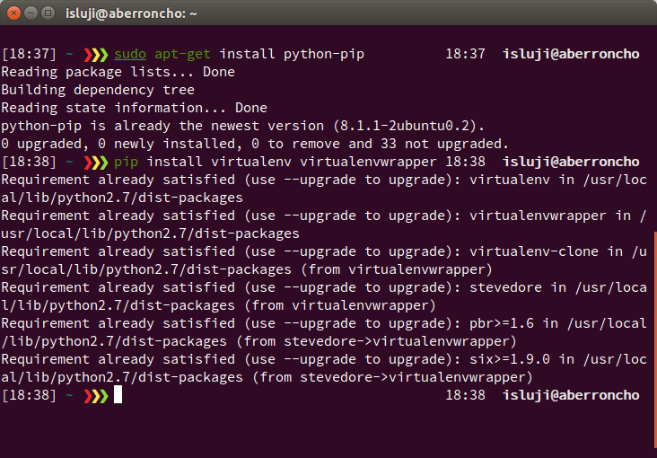
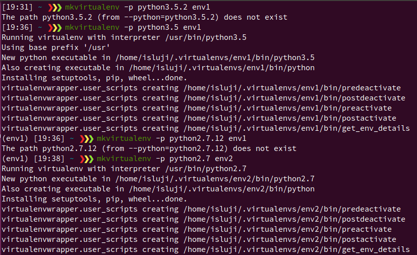
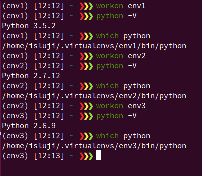
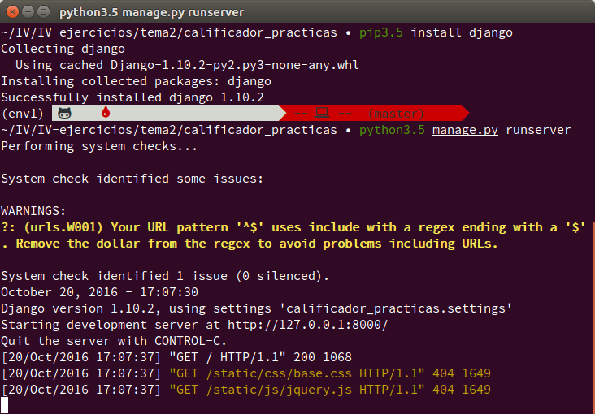
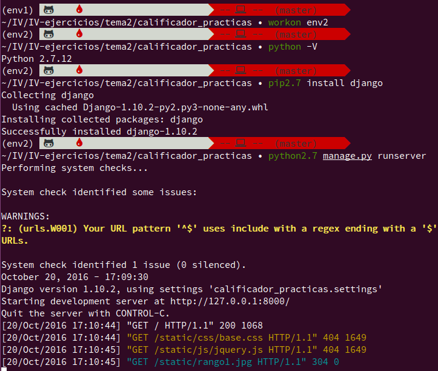
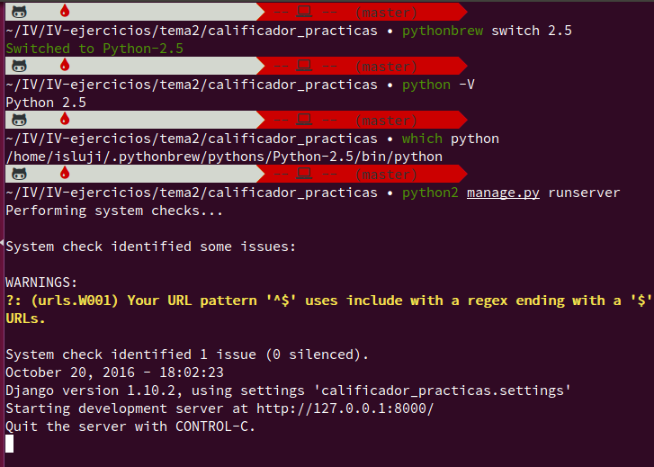
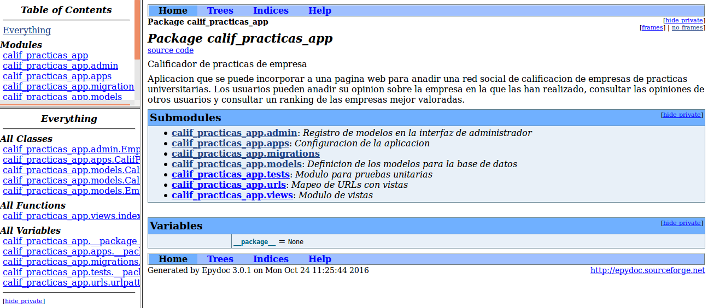
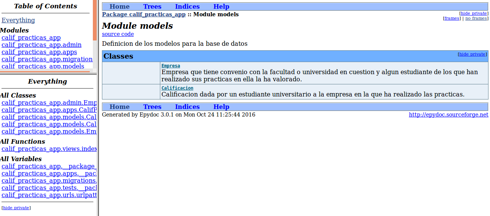
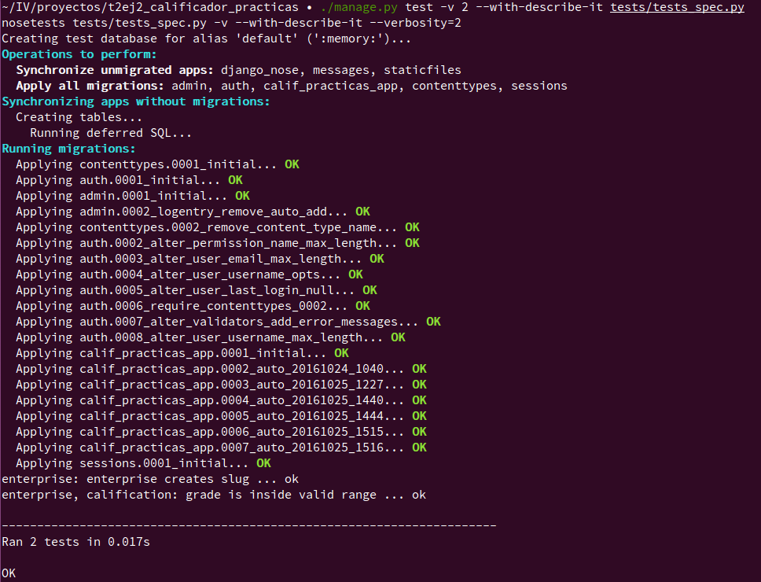

# EJERCICIOS TEMA 2

## Ejercicio 1

#### Instalar alguno de los entornos virtuales de node.js (o de cualquier otro lenguaje con el que se esté familiarizado) y, con ellos, instalar la última versión existente, la versión minor más actual de la 4.x y lo mismo para la 0.11 o alguna impar (de desarrollo).

Para el ejercicio voy a utilizar Python, su entorno virtual virtualenv y su gestor de entornos virtuales virtualenvwrapper, puesto que ya los he instalado y me he familiarizado con ellos para realizar el proyecto de la asignatura utilizando Flask.

Para instalar este entorno virtual, utilizamos el gestor de paquetes de Python pip (suponiendo que ya tenemos instaladas las librerías del lenguaje en el sistema):



Una vez instalados los paquetes, procedemos a crear y configurar los entornos virtuales mencionados en el enunciado (pero adaptados al lenguaje Python):

  - 1. Última versión existente => Python 3.5
  - 2. Versión minor más actual de Python 2.x => Python 2.7
  - 3. Versión impar (de desarrollo) => Python 2.5

Para poder utilizar los comandos de virtualenv para crear, usar y eliminar entornos virtuales directamente en la terminal sin tener que activarlos previamente, tenemos que añadir las siguientes líneas al archivo de configuración de nuestra shell (en mi caso, el archivo .zshrc de zsh):

```bash
export WORKON_HOME=$HOME/.virtualenvs       # Directorio donde se almacenarán los entornos virtuales
export PROJECT_HOME=$HOME/IV                # Directorio en el que se encuentran nuestros proyectos Python
source /usr/local/bin/virtualenvwrapper.sh  # Ejecuta el script que activa virtualenv y virtualenvwrapper
```

Creamos los entornos virtuales con la orden mkvirtualenv, utilizando la opción -p para especificar la versión de Python que queremos que contenga cada entorno virtual.



Con esta opción, no podemos especificar cualquier versión de Python, sino sólo aquellas que estén instaladas en nuestro sistema. Por tanto, para el tercer entorno no he podido utilizar la versión 2.5 sino otra que tenía instalada:



Para poder probar la página en Python 2.5, utilizaré pythonbrew para cambiar la versión de Python utilizada globalmente en nuestro sistema (hay que instalar también Django para cada distribución de Python que usemos).


## Ejercicio 2

#### Como ejercicio, algo ligeramente diferente: una web para calificar las empresas en las que hacen prácticas los alumnos. Las acciones serían:

   - **Crear empresa**
   - **Listar calificaciones para cada empresa**
   - **Crear calificación y añadirla (comprobando que la persona no la haya añadido ya)**
   - **Borrar calificación (si se arrepiente o te denuncia la empresa o algo)**
   - **Hacer un ránking de empresas por calificación, por ejemplo**
   - **Crear un repositorio en GitHub para la librería y crear un pequeño programa que use algunas de sus funcionalidades.**

#### Si se quiere hacer con cualquier otra aplicación, también es válido. Se trata de hacer una aplicación simple que se pueda hacer rápidamente con un generador de aplicaciones como los que incluyen diferentes marcos MVC. Si cuesta mucho trabajo, simplemente prepara una aplicación que puedas usar más adelante en el resto de los ejercicios.

#### La aplicación tendrá más adelante un interfaz web, pero por lo pronto, y a efectos de la prueba continua de más adelante, vamos a quedarnos sólo con un pequeño programa que sirva para ver que funciona.

[Enlace al repositorio de la aplicación](https://github.com/isma94/calificador_practicas)


## Ejercicio 3

#### Ejecutar el programa en diferentes versiones del lenguaje. ¿Funciona en todas ellas?

Para ello, tendremos que instalar el framework Django en los 3 entornos virtuales (utlizando la correspondiente versión de pip), y ejecutar el manage.py utilizando la versión de Python de cada uno de ellos para ver si la página funciona.

- 1. Última versión existente => Python 3.5



- 2. Versión minor más actual de Python 2.x => Python 2.7



- 3. Versión impar (de desarrollo) => Python 2.5




## Ejercicio 4

#### Crear una descripción del módulo usando package.json. En caso de que se trate de otro lenguaje, usar el método correspondiente.

La alternativa para Python son los denominados ficheros de requisitos (requirements) y ficheros de restricciones (constraints). Los ficheros de requisitos contienen una lista de dependencias (los paquetes de PyPI necesarios para instalar la aplicación) que serán instaladas mediante pip. Los ficheros de restricciones tienen otra función: los paquetes que aparezcan en ellos no serán instalados por defecto, pero si la aplicación que se va a instalar requiere alguno de ellos, éstos serán instalados en la versión indicada en el fichero.

Para instalar las dependencias de una aplicación ejecutamos esta orden:

```bash
pip install -r requirements.txt -c constraints.txt
```

Si ya tenemos el proyecto desarrollado y queremos recopilar las dependencias que hemos tenido que instalar
durante el desarrollo, podemos utilizar la opcion "freeze" de pip, cuya salida se puede utilizar como
archivo requirements.txt para portar la aplicación. Sin embargo, este método no es recomendable puesto
que se incluyen todos los paquetes que se encuentren instalados en el entorno, y puede que muchos
de ellos no sean necesarios para esta aplicación sino que sean dependencias de proyectos anteriores.
La buena práctica es ir añadiendo al requirements.txt las dependencias que vayamos necesitando.

```bash
pip freeze --all > requirements.txt
```

En el caso de mi aplicación, la única dependencia que necesito es Django, pero utilizando la opción --all
obtengo además mis versiones de las herramientas de instalación de Python (que por defecto no aparecen).
Este es el aspecto de mi requirements.txt:

```python
Django==1.10.2
pip==8.1.2
setuptools==28.6.0
wheel==0.30.0a0
```


## Ejercicio 5

#### Automatizar con grunt y docco (o algún otro sistema) la generación de documentación de la librería que se cree. Previamente, por supuesto, habrá que documentar tal librería.

Para documentar un proyecto Python, tenemos varias herramientas disponibles, entre las más utilizadas están pydoc, sphinx y epydoc. He decidido utilizar epydoc, pues es más sencillo de configurar. Esta herramienta genera documentación en varios formatos (elegiremos HTML) a partir de los "docstrings" que escribamos en el código.

Para obtener la documentación de la aplicación, sólo hemos de ejecutar los siguientes comandos:

epydoc --html calificador_practicas -o calificador_practicas/doc
epydoc --html calif_practicas_app -o calif_practicas_app/doc

**Al ejecutar epydoc para calif_practicas_app, obtengo una serie de errores que no he conseguido resolver.
Aun así, se genera la documentación (parecen estar todos mis docstrings, aunque pueden faltar cosas)**

Podemos ver la documentación HTML que se ha generado accediendo al directorio doc/ de cada paquete:






## Ejercicio 6

#### Para la aplicación que se está haciendo, escribir una serie de aserciones y probar que efectivamente no fallan. Añadir tests para una nueva funcionalidad, probar que falla y escribir el código para que no lo haga (vamos, lo que viene siendo TDD).

Para realizar pruebas unitarias, Python cuenta con una librería estandar denominada unittest (que hace tanto de marco de pruebas como de motor para ejecutarlas). Django utiliza esta librería para automatizar los tests en los proyectos. Como simplemente vamos a crear un test de aserciones para probar esta funcionalidad, podemos hacerlo en el archivo tests.py generado por Django. Sin embargo, para realizar tests para todo el proyecto se recomienda distribuirlo creando un paquete con un archivo de prueba para cada submódulo.

[Enlace a los tests unittest](https://github.com/isma94/calificador_practicas/blob/master/tests/tests.py)

Como nueva funcionalidad, voy a añadir el registro y autenticación de usuarios en la página web.

**########## FALTA POR HACER ###########**


## Ejercicio 7

#### Convertir los tests unitarios anteriores con assert a programas de test y ejecutarlos desde mocha, usando descripciones del test y del grupo de test de forma correcta. Si hasta ahora no has subido el código que has venido realizando a GitHub, es el momento de hacerlo, porque lo vas a necesitar un poco más adelante.

Utilizaré el marco de pruebas para Python "nose", que extiende la funcionalidad de unittest para aportar mayor sencillez. Nose recolecta todo paquete, módulo, clase o método que coincida con testMatch (o sea, que incluya 'test' o 'Test' en alguno de los extremos o separado por - o _ ), además de todas las subclases de unittest.TestCase (del mismo modo en que lo hace unittest).

Además, cuenta con una versión específica para Django denominada "django-nose", que añade diversas funcionalidades y funciona con los mismos plugins que la versión normal. Hablando de plugins, he encontrado uno denominado "describe-it" que nos permite escribir tests unitarios al estilo describe/it utilizado por mocha. Los módulos que escribamos utilizando esta sintaxis deben acabar en 'spec' para que el "test runner" los considere como tal.

Podemos instalar todo lo anterior utilizando pip. Para configurar django-nose, añadimos la línea **'django_nose'** a las INSTALLED_APPS de nuestro settings.py y añadimos la siguiente variable:

```python
TEST_RUNNER = 'django_nose.NoseTestSuiteRunner'
```

Ya podemos convertir los tests anteriores a programas de test y ejecutarlos con nose (al estar integrado con django y recoger también los tests de unittest, los tests se ejecutan con el mismo comando que antes:



[Enlace a los tests nose con describe-it](https://github.com/isma94/calificador_practicas/blob/master/tests/tests_spec.py)


## Ejercicio 8

#### Integración continua: Haced los dos primeros pasos antes de pasar al tercero

Para trabajar con estos sistemas, generalmente hay que ejecutar estos tres pasos:

  1. Darse de alta. Muchos están conectados con GitHub por lo que puedes autentificarte directamente desde ahí. A través de un proceso de autorización, puedes acceder al contenido e incluso informar del resultado de los tests a GitHub.

  2. Activar el repositorio en el que se vaya a aplicar la integración continua. Travis permite hacerlo directamente desde tu configuración; en otros se dan de alta desde la web de GitHub.

Una vez registrados en Travis y conectados con nuestra cuenta de GitHub, y habiendo activado el repositorio de esta aplicación, debemos asegurarnos de proveer a Travis con los ficheros necesarios para que pueda ejecutar los tests (y por ende, el programa). Estos son el requirements.txt y el fichero de configuración de travis, .travis.yml, en el que indicamos, entre otras cosas, la versión de Python a utilizar, el comando utilizado para instalar las dependencias y el marco de pruebas a utilizar.

Puesto que he instalado diversas herramientas desde el ejercicio 4, las dependencias para mi aplicación han aumentado, quedando de la siguente manera:

```python
alabaster==0.7.9
Babel==2.3.4
describe-it==2.2.2
Django==1.10.2
django-nose==1.4.4
docutils==0.12
imagesize==0.7.1
Jinja2==2.8
MarkupSafe==0.23
nose==1.3.7
pip==8.1.2
Pygments==2.1.3
pytz==2016.7
setuptools==28.6.0
six==1.10.0
snowballstemmer==1.2.1
wheel==0.30.0a0
```

  3. Crear un fichero de configuración para que se ejecute la integración y añadirlo al repositorio.

En este caso, el archivo se ha de llamar .travis.yml y contener la siguiente configuración:

```yml
language: python
python:
  - "2.7"
# command to install dependencies
install: "pip install -r requirements.txt"
# command to run tests
script: nosetests --with-describe-it
```
