# Ejercicios Tema 3 (Creando aplicaciones en la nube: Uso de PaaS)

## Ejercicio 1

### Darse de alta en algún servicio PaaS tal como Heroku, Nodejitsu, BlueMix u OpenShift.

Aprovechando que tiene cuentas de estudiante, me he creado una cuenta de IBM BlueMix. Utilizando mi dirección de correo electrónico de la UGR, me he registrado en el siguiente enlace:

https://ibm.onthehub.com/WebStore/OfferingDetails.aspx?o=bb3528b7-2b63-e611-9420-b8ca3a5db7a1

Esta cuenta consta de 6 meses de uso gratuito. Para utilizarla, hemos de registrarnos en primer lugar en IBM BlueMix, con lo cual obtenemos el mes de prueba estándar:

https://console.ng.bluemix.net/registration/

Una vez dentro del panel de BlueMix, hemos de buscar el menú "Billing" e introducir el código que nos han enviado por correo para activar los 6 meses gratis.


## Ejercicio 2

### Crear una aplicación en OpenShift o en algún otro PaaS en el que se haya dado uno de alta. Realizar un despliegue de prueba usando alguno de los ejemplos.

Para realizar el ejercicio, me he registrado en la "developer preview" de OpenShift 3. Para crear la aplicación, se puede utilizar el panel web pero se recomienda hacerlo todo desde la herramienta de comandos. La de OpenShift se llama "oc" y se puede descargar en [este enlace](https://console.preview.openshift.com/console/command-line) (también se nos muestran los comandos básicos de la herramienta). Desde dicho enlace, también podemos obtener el token de la sesión actual, el cual podemos usar para acceder a nuestra cuenta desde la terminal (también podemos usar nuestro usuario y contraseña).

Tras loguearme, he creado un proyecto y una aplicación de prueba. Como aplicación, he utilizado el ejemplo que proporciona oc cuando creas un nuevo proyecto (una app de Ruby). Previamente, he creado un fork del repositorio del ejemplo en mi repositorio de GitHub (lo mencionaban en varios tutoriales aunque en este caso no sería necesario puesto que no vamos a modificar el código).

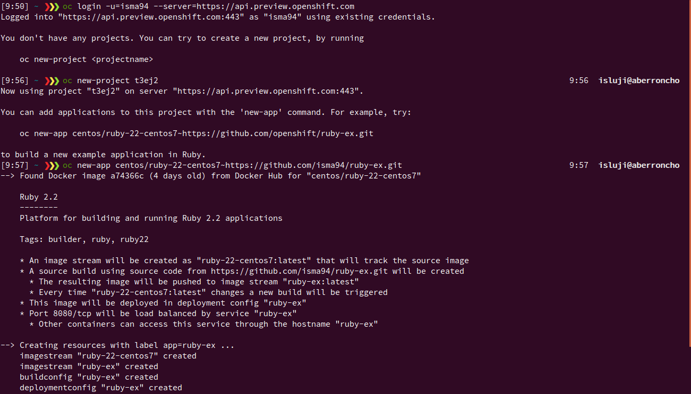

A continuación, aparecen estas dos líneas de código:

```bash
Build scheduled, use 'oc logs -f bc/ruby-ex' to track its progress.
Run 'oc status' to view your app.
```

Utilizando 'oc logs -f bc/myapp', puedo seguir el progreso de la construcción de la aplicación.

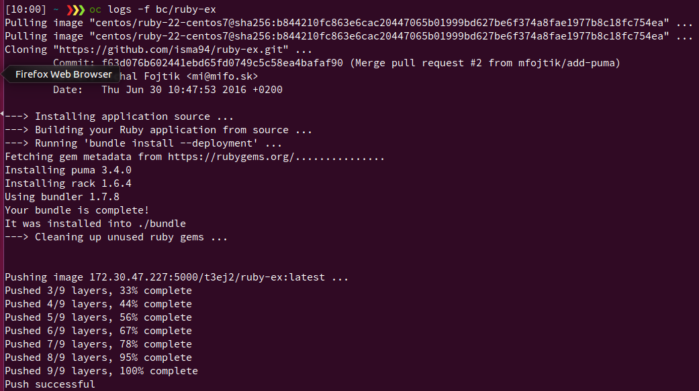

Mientras que, una vez el proceso ha terminado, podemos comprobar el estado de la aplicación con 'oc status'. Además, utilizando el comando 'oc get pods' podemos comprobar si la aplicación se está efectivamente ejecutando.

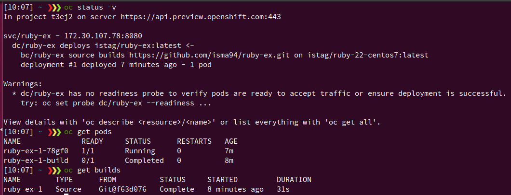

Para exponer el servicio públicamente, generamos una ruta HTML utilizando los siguientes comandos:

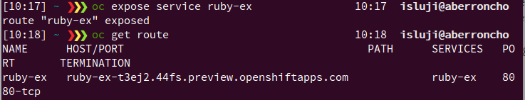

Accedemos con el navegador a esta ruta para acceder a nuestra aplicación. En este caso, me aparece que la aplicación no está disponible, pero no se a qué se debe puesto que he seguido todos los pasos necesarios.

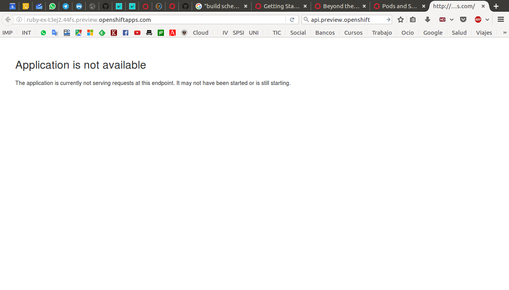

[TUTORIAL UTILIZADO](https://docs.openshift.com/container-platform/3.3/getting_started/developers_cli.html)

[REPOSITORIO ORIGINAL DE LA APLICACIÓN](https://github.com/openshift/ruby-ex)


## Ejercicio 3

### Realizar una app en express (o el lenguaje y marco elegido) que incluya variables como en el caso anterior.

Para generar la app, he utilizado el generador "express-generator", tal como se explica en [este tutorial](http://expressjs.com/en/starter/generator.html).

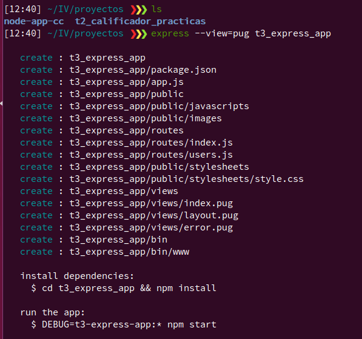

A continuación, he instalado las dependencias utilizando el siguiente comando:

```bash
cd t3_express_app && npm install
```

Pasamos a incluir algún ejemplo del uso de variables en las rutas. Por ejemplo, podemos hacer que la variable sea el nombre del usuario (:user), de forma que se muestre un mensaje de bienvenida a dicho usuario cuando accedemos a su ruta.

```js
router.get('/user/:user', function (req, res) {
	res.send( "Bienvenido, <b>" + req.params.user + "</b>!!!");
});
```

Añadimos esta función de ruta al archivo /routes/index.js del proyecto, puesto que es donde la estructura generada almacena estas funciones. Dada por terminada nuestra modificación, podemos proceder a lanzar la aplicación para comprobar su funcionamiento con el siguiente comando:

```bash
DEBUG=t3-express-app:* npm start
```

Si accedemos a una URL con el formato especificado, efectivamente obtenemos lo esperado:

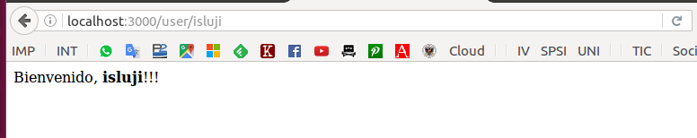

[REPOSITORIO DE LA APLICACIÓN](https://github.com/isma94/ejemplo_express)


## Ejercicio 4

### Crear pruebas para las diferentes rutas de la aplicación.

Para este ejercicio, he añadido otra ruta (en ella, utilizo el comando PUT para "introducir" una contraseña y que la aplicación pregunte si se ha escrito bien):

```js
router.put('/user/:username/:password', function (req, res) {
	res.send( "Hola, <b>" + req.params.username + "</b>!!! ¿Seguro que tu contrasena es <b>" + req.params.password + "</b>?");
});
```

Para realizar las pruebas, primero he tenido que instalar supertest en la aplicación:

```bash
npm install --save-dev supertest
```

Además, hemos de modificar el package.json para indicar qué herramienta vamos a utilizar para testear. Añadimos esta línea en el diccionario "scripts":

```js
"test": "mocha"
```

He creado un archivo test/test.js en el que he añadido los siguientes tests funcionales:

```js
var request = require('supertest');
var app = require('../app.js');

// Comprobar que la página de bienvenida al usuario se sirve correctamente
describe( "GET username", function() {
	it('should return HTML', function (done) {
		request(app)
  		.get('/user/isluji')
  		.expect('Content-Type', 'text/html; charset=utf-8')
  		.expect(200, done);
		}),
	it('should show username', function (done) {
  	request(app)
  		.get('/user/isluji')
  		.expect(200, "Bienvenido, <b>isluji</b>!!!", done);
	});
});

// Comprobar que el envío de la contraseña funciona correctamente
describe( "PUT password", function() {
	it('should check password', function (done) {
  	request(app)
  		.put('/user/isluji/passeito')
  		.expect('Content-Type', /text/)
  		.expect(200, "Hola, <b>isluji</b>!!! ¿Seguro que tu contrasena es <b>passeito</b>?", done);
	});
});
```

Para ejecutar los test, utilizamos el comando ```npm test```. Podemos ver a continuación cómo la aplicación pasa todos los test.

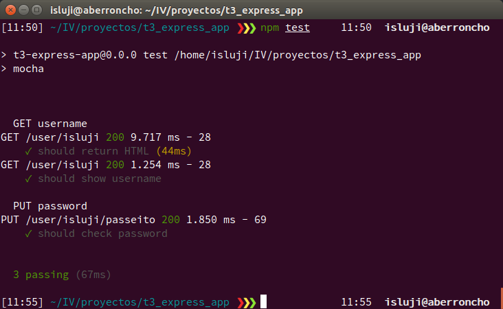


## Ejercicio 5

### Instalar y echar a andar tu primera aplicación en Heroku.

Para ello, seguimos [este tutorial](https://devcenter.heroku.com/articles/getting-started-with-nodejs). Los primeros pasos no los voy a mostrar puesto que son triviales.

1. Descargamos el cinturón de herramientas de Heroku.

```bash
wget -O- https://toolbelt.heroku.com/install-ubuntu.sh | sh
```

2. Hacemos login con ```heroku login```.

3. Descargamos la aplicación de ejemplo para node (es una aplicación simple de node + express).

```bash
git clone https://github.com/heroku/node-js-getting-started.git
cd node-js-getting-started
```

4. Creamos la aplicación en Heroku con ```heroku create```. Para que sea legalmente correcto, especificamos que se le asigne un servidor europeo. Además, establecemos un nombre con el que identifiquemos bien nuestra aplicación, puesto que de lo contrario se le asignará un nombre aleatorio. Los nombres de las aplicaciones constituyen un registro global para todo Heroku, por tanto, el nombre de nuestra aplicación no puede coincidir con el de ninguna aplicación de otro usuario.

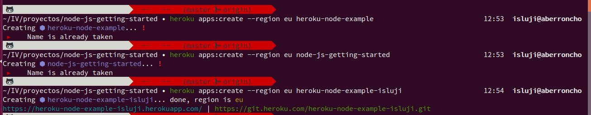

5. Desplegamos la aplicación en Heroku haciendo ```git push``` al remoto de git creado para tal efecto.

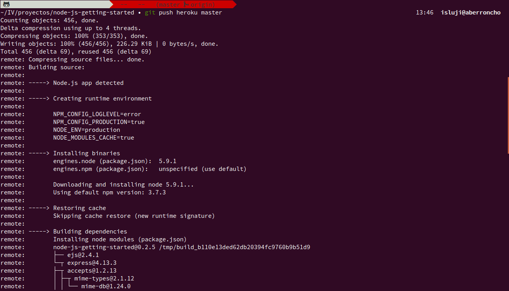

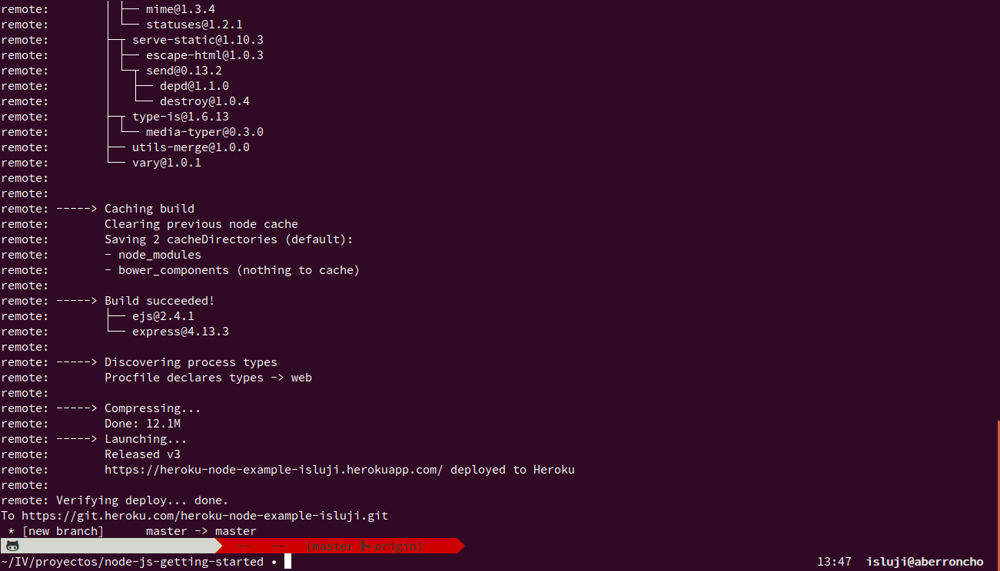

6. Tras crear la aplicación, el CLI nos proporciona dos enlaces web:

```
https://heroku-node-example-isluji.herokuapp.com/ | https://git.heroku.com/heroku-node-example-isluji.git
```

El primero de ellos es la URL con la cual accedemos a la aplicación, mientras que el segundo es la URL del repositorio remoto de git al que "pusheamos" los cambios para que se realize el despliegue en Heroku. De hecho, si accedemos mediante el navegador a dicho repositorio, se nos redirecciona a [este tutorial](https://devcenter.heroku.com/articles/git) para desplegar en Heroku mediante git, puesto que no se trata de un repositorio de GitHub a cuyo panel de control podamos acceder vía web.

Podemos asegurarnos de que al menos una instancia de la app se está ejecutando con el siguiente comando:

```bash
heroku ps:scale web=1
```

Para finalizar, accedemos a la aplicación mediante el enlace anterior o ejecutando ```heroku open```:

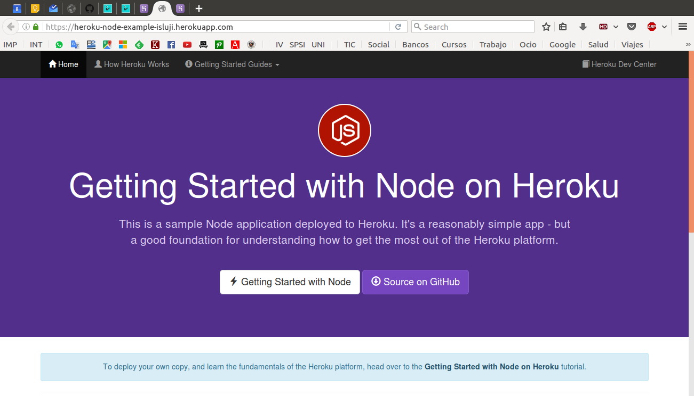


## Ejercicio 6

### Usar como base la aplicación de ejemplo de heroku y combinarla con la aplicación en node que se ha creado anteriormente. Probarla de forma local con foreman. Al final de cada modificación, los tests tendrán que funcionar correctamente; cuando se pasen los tests, se puede volver a desplegar en heroku. (Como en todos los ejemplos anteriores, se puede cambiar “node” y “heroku” por la herramienta que se haya elegido.)

Como indica este [artículo](https://devcenter.heroku.com/changelog-items/692), en la versión actual del toolbelt de Heroku se ha sustituido la herramienta "foreman" por el comando "heroku local", que está basado en "forego".

**NO TERMINADO**


## Ejercicio 7

### Haz alguna modificación a tu aplicación en node.js para Heroku, sin olvidar añadir los tests para la nueva funcionalidad, y configura el despliegue automático a Heroku usando Snap CI o alguno de los otros servicios, como Codeship, mencionados en [este enlace](http://stackoverflow.com/questions/17558007/deploy-to-heroku-directly-from-my-github-repository).

**NO REALIZADO**


## Ejercicio 8

### Preparar la aplicación con la que se ha venido trabajando hasta este momento para ejecutarse en un PaaS, el que se haya elegido.

**NO REALIZADO**
