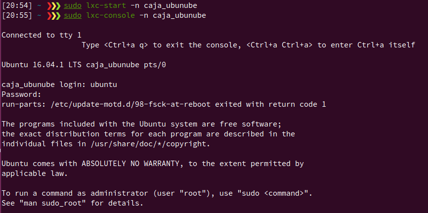
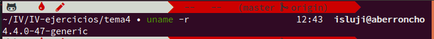
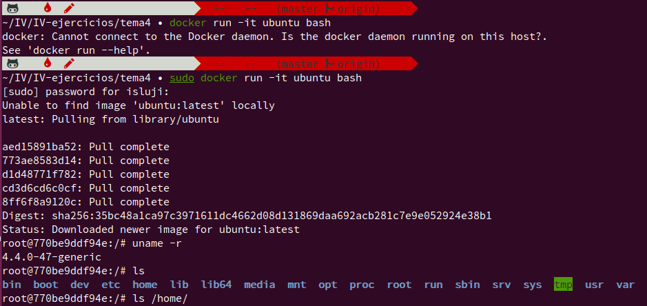
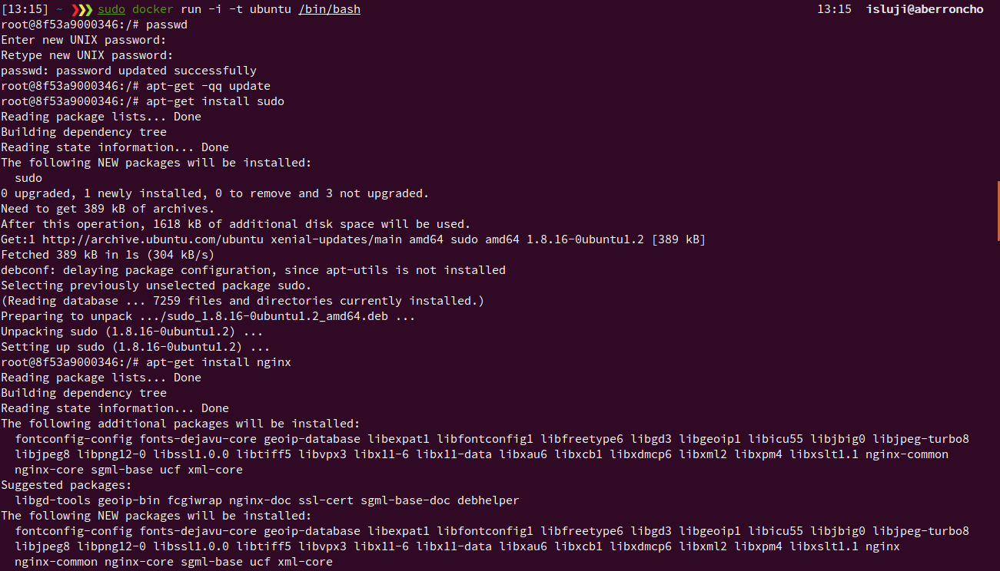

# Ejercicios Tema 4 (Virtualización ligera usando contenedores)

## Ejercicio 1

### Instala LXC en tu versión de Linux favorita. Normalmente la versión en desarrollo, disponible tanto en GitHub como en el sitio web, está bastante más avanzada; para evitar problemas sobre todo con las herramientas que vamos a ver más adelante, conviene que te instales la última versión y si es posible una igual o mayor a la 1.0.

En Ubuntu es tan simple como ejecutar el siguiente comando:

```bash
sudo apt-get install lxc
```

Podemos apreciar que la versión es adecuada (>= que la 1.0) en la siguiente captura:


## Ejercicio 2

### Comprobar qué interfaces puente se han creado y explicarlos.

Parece ser que en las últimas versiones de LXC, el comando ```lxc-list``` ha sido sustituido por ```lxc-ls```. El funcionamiento es el mismo, aquí podemos ver los dos contenedores que hemos creado.


Lanzamos uno de los contenedores y nos conectamos a él:



En el sistema host, se crean las dos interfaces de red mencionadas (**lxcbr0** y **veth**). Se crea una interfaz **veth** (seguida de un identificador) en el host por cada contenedor que creamos.


Mientras que en el contenedor se crean las interfaces **eth0** y **lo**:


Una interfaz puente no es realmente una interfaz de red sino una conexión entre dos redes. La interfaz **eth0** de un contenedor y la interfaz **veth** correspondiente del host son un mismo dispositivo virtual, que se conecta con la interfaz de red real del host a través del bridge **lxcbr0**.


## Ejercicio 3

### Crear un contenedor basado en tu distribución (p.e. Debian) y otro basado en otra que no sea la tuya (p.e. Fedora). Fedora, al parecer, tiene problemas si estás en Ubuntu 13.04 o superior, así que en tal caso usa cualquier otra distro. [Por ejemplo, Óscar Zafra ha logrado instalar Gentoo usando un script descargado desde su sitio, como indica en este comentario en el issue.](https://github.com/IV-GII/GII-2013/issues/87#issuecomment-28639976)

Podemos ver los templates de distro disponibles en LXC accediendo al siguiente directorio:


Mi sistema operativo es Ubuntu 16, por tanto he preferido no realizarlo con Fedora para evitar posibles problemas. He creado un contenedor con Debian y otro con Gentoo. Para crear el contenedor de Gentoo, no he necesitado el script que se comenta en el enunciado, sino que ya se incluye en las distros disponibles como template en LXC.

Para crear los contenedores, he utilizado estos comandos:

```bash
sudo lxc-create -t debian -n caja_debian
sudo lxc-create -t gentoo -n caja_gentoo
```

A continuación, iniciamos ambos contenedores, y ya estamos listos para ejecutarlos:


## Ejercicio 4

### 1. Instalar lxc-webpanel y usarlo para arrancar, parar y visualizar las máquinas virtuales que se tengan instaladas.

He instalado lxc-webpanel siguiendo [estas instrucciones](http://lxc-webpanel.github.io/install.html), y he arrancado, pausado y apagado mis contenedores hasta alcanzar la siguiente configuración:


Aquí podemos ver la configuración del único contenedor que he dejado ejecutándose (para poder guardar los cambios en la configuración, me ha exigido cambiar el nombre del contenedor ¿?, así que lo he cambiado a cajaDebian).


### 2. Desde el panel restringir los recursos que pueden usar: CPU shares, CPUs que se pueden usar (en sistemas multinúcleo) o cantidad de memoria.

He restringido la memoria del contenedor a 1GB, dejando el límite de memoria+swap bastante más alto para que haya espacio suficiente para swapping cuando el contenedor llegue a su límite de memoria. La opción **CPU** establece qué núcleos de la CPU puede usar el contenedor, indicándolos mediante índices; en una CPU de 4 núcleos, estos están en el rango 0-3 (por ejemplo, si ponemos "1,3" dicho contenedor sólo podrá usar los núcleos 1 y 3). Por otro lado, la opción **CPU Shares** se utiliza para establecer el reparto de tiempo de CPU entre todos los contenedores, y se indica mediante cuotas relativas: por ejemplo, si tenemos 2 contenedores y le damos a uno un share de 20 y al otro 80, al primero se le asigna un 20% del tiempo de CPU y al segundo el 80% restante (como son cuotas relativas, podemos usar cualquier escala; cualquiera dos valores que tengan la misma proporción harían el mismo efecto, por ejemplo 10 y 40).


## Ejercicio 5

### Comparar las prestaciones de un servidor web en una jaula y el mismo servidor en un contenedor. Usar nginx.

**---------- NO REALIZADO -----------**


## Ejercicio 6

### Instalar docker.

Mi sistema operativo es Ubuntu Xenial 16.04 (LTS), que está soportado por Docker. Además, mi sistema cumple los dos prerrequisitos necesarios para instalar Docker: es de 64 bits y el kernel de Linux es superior a la versión 3.10.



Como hay que instalar ciertas dependencias y seguir una serie de pasos, he creado un [script que instala Docker en cualquier sistema Ubuntu Xenial](./installDocker_xenial.sh)). Podemos ver a continuación que la imagen Docker de prueba **hello-world** ha sido ejecutada con éxito.


sudo service docker start


## Ejercicio 7

### 1. Instalar a partir de docker una imagen alternativa de Ubuntu y alguna adicional, por ejemplo de CentOS.

He instalado la imagen de Ubuntu que se recomienda como ejemplo avanzado en el ejemplo hello-world de Docker:



Como imagen adicional, voy a instalar la imagen Docker oficial de ownCloud:


### 2. Buscar e instalar una imagen que incluya MongoDB.

Esta vez voy a instalar una imagen que no es la oficial, sino que ha sido creada por la empresa TorusWare añadiendo su software de aceleración de red Speedus a una instalación con la última versión de MongoDB.


## Ejercicio 8

### Crear un usuario propio e instalar nginx en el contenedor creado de esta forma.

He utilizado la imagen de Ubuntu que instalé en el ejercicio 7 para esto. Primero, he creado un usuario en semejanza al que uso en el host, y le he dado


A continuación, he instalado el servidor web nginx. Para utilizar apt, he necesitado acceder como root, puesto que ```sudo``` no viene instalado por defecto. Además, para poder instalar paquetes, hemos de realizar un ```apt-get update```, puesto que la caché de paquetes está vacía al crear el contenedor.



Para comprobar que funciona, averiguo cuál es la IP que se le ha asignado al contenedor con ```docker inspect```:


Finalmente, podemos conectar con el contenedor a través del navegador del host:


## Ejercicio 9

### Crear a partir del contenedor anterior una imagen persistente con commit.

Al estilo del commit de git, con ```docker commit``` podemos guardar los cambios realizados en un contenedor (paquetes instalados o desinstalados, cambios en la configuración, ficheros modificados) especificando un resumen de los cambios y el nombre de la nueva imagen que queremos crear para guardar el estado actual del contenedor. Utilizando ```docker images```, podemos observar como la nueva imagen (isluji/ubuntu_nginx) ocupa un espacio en disco notablemente mayor que la anterior (ubuntu), debido a los nuevos paquetes instalados.


## Ejercicio 10

### Crear una imagen con las herramientas necesarias para el proyecto de la asignatura sobre un sistema operativo de tu elección.

Para ello, utilizaré un fichero **Dockerfile** para crear y provisionar la imagen de forma automatizada.


## BIBLIOGRAFÍA

### Ejercicio 2

https://wiki.debian.org/LXC/MasqueradedBridge

### Ejercicio 4

https://www.flockport.com/lxc-advanced-guide/
https://www.cloudsigma.com/manage-docker-resources-with-cgroups/

### Ejercicio 6

https://docs.docker.com/engine/installation/linux/ubuntulinux/
