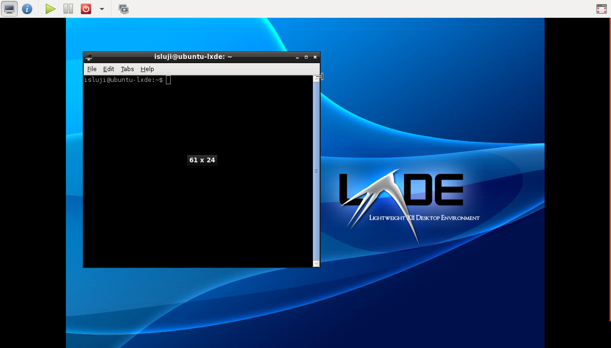
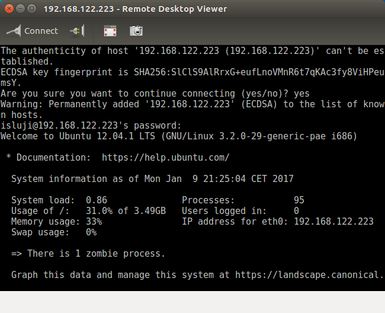
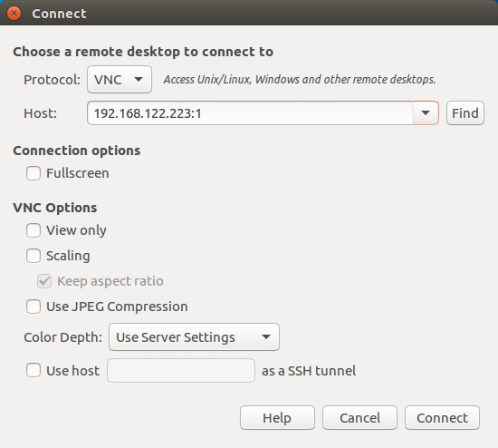
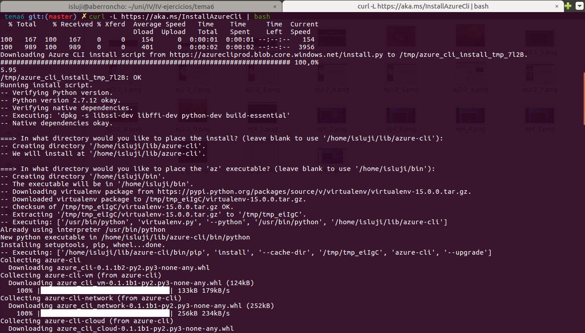
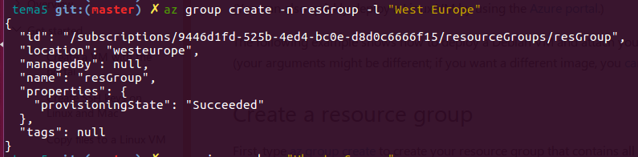

# Ejercicios Tema 5 (Virtualización completa: uso de máquinas virtuales)

## Ejercicio 1

### Instalar los paquetes necesarios para usar KVM. Se pueden seguir [estas instrucciones](https://wiki.debian.org/KVM#Installation). Ya lo hicimos en el primer tema, pero volver a comprobar si nuestro sistema está preparado para ejecutarlo o hay que conformarse con la paravirtualización.

Primero, voy a comprobar si mi sistema cumple los requisitos para ejecutar este tipo de virtualización. El componente que se analiza es el procesador, pues es quien debe incorporar las tecnologías necesarias.

Mi portátil consta de un procesador Intel® Core™ i5-2450M CPU @ 2.50GHz × 4. Utilizando el fichero ```/proc/cpuinfo``` y la herramienta ```kvm-ok``` (contenida en el paquete **cpu-checker**), he podido comprobar que este procesador soporta tanto la virtualización x86 (Intel VT-x) como la virtualización KVM.


Por tanto, podré utilizar la tecnología KVM y no tendré que recurrir a la paravirtualización. Para utilizar esta tecnología, he tenido que instalar estos paquetes (todos se instalan de forma trivial con ```apt-get```):

* **qemu-kvm**: Hipervisor
* **libvirt-bin**: Daemon que carga el módulo KVM apropiado según el procesador
* Para crear las máquinas virtuales, podemos usar tanto la CLI **virtinst** como la GUI **virt-manager**


## Ejercicio 2

### 1. Crear varias máquinas virtuales con algún sistema operativo libre tal como Linux o BSD. Si se quieren distribuciones que ocupen poco espacio con el objetivo principalmente de hacer pruebas se puede usar CoreOS (que sirve como soporte para Docker); GALPon Minino, hecha en Galicia para el mundo; Damn Small Linux, SliTaz (que cabe en 35 megas) y ttylinux (basado en línea de órdenes solo).

### 2. Hacer un ejercicio equivalente usando otro hipervisor como Xen, VirtualBox o Parallels.

1. Voy a instalar dos máquinas virtuales: una con Damn Small Linux y otra con SliTaz.

Para crear una máquina virtual, lo primero es crear un disco duro virtual. Creamos dos ficheros **QCOW2** utilizando la herramienta ```qemu-img``` (como estas distribuciones son muy ligeras, no hace falta asignarles mucho espacio):


Ya tenemos todos los requisitos, por lo que podemos lanzar las MV con KVM ejecutando los siguientes comandos:

* Lanzar MV Damn Small Linux: ```qemu-system-x86_64 -hda vhd_dsl.qcow2 -cdrom /media/isluji/ISMAEL/Informatica/so/damn-small-linux-4.11.rc2.iso```

* Lanzar MV SliTaz: ```qemu-system-x86_64 -hda vhd_slitaz.qcow2 -cdrom /media/isluji/ISMAEL/Informatica/so/slitaz-4.0.iso```

----------------------

Primero voy a instalar la MV con Damn Small Linux. Este SO está diseñado para usarse como LiveCD; de todas formas, es posible su instalación en disco duro de dos formas: el método "tradicional", que lo instala como una distro de Debian, y el método "frugal", que instala el sistema de archivos comprimido y lo carga en memoria con cada arranque tal como haría un LiveCD. Los desarrolladores recomiendan este último método, puesto que ofrece varias ventajas, como la posibilidad de actualizar el SO sin reinstalarlo desde 0 y de utilizar ciertas aplicaciones diseñadas específicamente para su uso en un entorno frugal/LiveCD.

Para instalar DSL, primero hay que crear una partición en el disco duro virtual. Para ello, utilizamos la herramienta **cfdisk**, ejecutándola sobre el dispositivo virtual que hemos especificado al arrancar la MV (**hda** => ```cfdisk /dev/hda```). Una vez dentro, creamos una tabla de particiones vacía; a continuación, creamos una partición primaria con ***New*** y le activamos el flag ***Bootable***; y, finalmente, sobrescribimos la tabla de particiones con ***Write***.


Ahora podemos utilizar la partición recién creada (**hda1**) para instalar el SO. Para ello, accedemos a la herramienta ***Frugal Install***. También podemos crear otra partición opcional para almacenar las extensiones MyDSL (aplicaciones que se instalan en disco duro); si no lo hacemos, tendremos que copiar manualmente estas extensiones al almacenamiento permanente si queremos preservarlas.


----------------------

Procedo a lanzar la segunda máquina virtual, esta vez con la distro SliTaz. Esta distro también está diseñada para su uso como LiveCD/USB, y a simple vista no he encontrado ninguna opción o herramienta para instalarlo en el disco duro. Buscando en la documentación, he descubierto que sí se puede [instalar de diversas formas](http://doc.slitaz.org/en:handbook:installation), pero no lo considero necesario para este ejercicio.


----------------------

2. De los hipervisores mencionados, voy a utilizar **VirtualBox**.


Al tratarse de una GUI, la creación del disco duro virtual está incluida en el wizard de creación de la máquina virtual.


También podemos utilizar uno de los discos duros creados anteriormente, pero en este caso vamos a crear dos nuevos HD virtuales con el formato propio de VirtualBox, **VDI (VirtualBox Disk Image)**.


Elegimos la opción "asignado dinámicamente" para que el disco duro virtual sólo ocupe en el real el espacio que se vaya llenando al instalar cosas en la MV (hasta un máximo que fijamos nosotros).


Le asignamos el nombre y el tope de espacio que queramos y creamos el disco duro virtual. 


Con esto finalizamos el wizard, ya tenemos la MV creada y nos aparecerá en la lista de MVs de VirtualBox.

Realizamos el mismo proceso para crear la MV de SliTaz. Desde la pantalla principal de VirtualBox, podemos lanzar las MVs que hemos creado y ver sus características.


Al arrancarlas, nos pedirá que seleccionemos la ISO que usaremos para cargar el SO.


Una vez seleccionamos la ISO, ya podemos arrancar la MV e instalar el SO en el disco duro virtual si así lo deseamos.


## Ejercicio 3

### Crear un benchmark de velocidad de entrada/salida y comprobar la diferencia entre usar paravirtualización y arrancar la máquina virtual simplemente con ```qemu-system-x86_64 -hda /media/Backup/Isos/discovirtual.img```.

**NO REALIZADO**


## Ejercicio 4

### Crear una máquina virtual Linux con 512 megas de RAM y entorno gráfico LXDE a la que se pueda acceder mediante VNC y ssh.

Esta vez crearé la máquina virtual utilizando **VMM (Virtual Machine Manager)**, la GUI para QEMU/KVM instalada mediante el paquete ***virt-manager***. El proceso de creación de una MV es similar al seguido en VirtualBox, por lo que no voy a describirlo paso a paso, sino que me centraré en la conexión mediante VNC y SSH.

Como dispongo de una ISO de Ubuntu Server 12.04 de 32 bits, la utilizaré para "convertirla en Lubuntu" cambiando el gestor de ventanas de serie (GNOME) por LXDE, en vez de descargarme una nueva distro.


Una vez instalados estos paquetes, podemos acceder al escritorio LXDE con ```startx```.



Para realizar las conexiones, vamos a instalar en la MV los servidores de OpenSSH y TightVNC:

```bash
sudo apt-get install openssh-server tightvncserver
```

Tras instalarlo, procedemos a realizar la configuración inicial de TightVNC ejecutando el comando ```vncserver```, en la que tendremos que crear un usuario con el que poder conectar. Al finalizar, se lanza una instancia de escritorio VNC en el puerto 5901 (escritorio :1).

Como el SO de la MV es Ubuntu Server, el servidor VNC viene configurado por defecto para GNOME, que es el gestor de ventanas de serie con Ubuntu. Como he cambiado a LXDE, tengo que cambiar la configuración para poder lanzar el escritorio automáticamente al lanzar el servidor VNC. Para ello, primero he tenido que apagar el servidor:

```bash
vncserver -kill :1
```


Una vez hecho esto, ya puedo editar el fichero de configuración localizado en ~/.vnc/xstartup. He sustituido la línea ```/etc/X11/Xsession``` por esta otra: ```/usr/bin/startlxde```.


Para conectar con la MV, en mi host he instalado el cliente Vinagre, que soporta tanto SSH como VNC, entre otros.

Primero, observamos cual es la IP de la MV utilizando el comando ```ifconfig```:


Listo. Ya podemos conectar mediante SSH desde nuestro host utilizando Vinagre:




Para conectarnos mediante VNC, además de la IP hemos de indicar el ID del escritorio al que nos vamos a conectar (o el puerto equivalente). En este caso, es el :1 (puerto 5901).



Nos pedirá que introduzcamos nuestra contraseña de acceso de VNC. Finalmente, ya podemos "trastear" en el escritorio de nuestra MV desde nuestro host.


## Ejercicio 5

### Crear una máquina virtual Ubuntu utilizando el CLI de Azure e instalar en ella alguno de los servicios que estamos usando en el proyecto de la asignatura.

Voy a hacerlo con la nueva versión del CLI de Azure (2.0), que utiliza el comando "az" en vez de "azure", y así voy cogiendo manejo para utilizarla en el hito 5 del proyecto. Para instalarla en Linux, los chicos de Microsoft tienen un script que se puede ejecutar con el siguiente comando:

```bash
curl -L https://aka.ms/InstallAzureCli | bash
```

Reiniciamos la terminal con `exec -l $SHELL` y ya estamos listos para usar la CLI. 



Buscamos la imagen que queramos instalar con la orden `az vm image list`; en este caso, vamos a seleccionar una máquina Ubuntu. Para crear la MV, voy a utilizar el tutorial que proporciona Microsoft en la ayuda (`az vm create -h`).


Primero, hemos de crear un "resource group", dentro del cual añadiremos nuestra nueva MV.

```bash
az group create -n resGroup -l "West Europe"
```



Con `az vm create`, creamos una MV Ubuntu Server con autenticación de clave pública SSH y un nombre DNS público. El *authentication-type* por defecto en Linux es **ssh**, y el nombre del usuario admin por defecto es el de mi usuario en mi sistema, por lo que no tengo que añadir estas opciones al comando.

```bash
az vm create -n ejemplo-ubuntu -g resGroup \
--image Canonical:UbuntuServer:14.04.4-LTS:latest \
--ssh-key-value ~/.ssh/azure_rsa.pub \
--public-ip-address-dns-name ejemplo-ubuntu \
--location "West Europe"
```


Como tardaba demasiado, he cancelado la operación pensando que había escrito mal el comando, pero no era así. Al ejecutarlo de nuevo, me notificaba de que ya se había creado una MV con esas características. Listando las MV disponibles, he podido comprobar que se había creado correctamente.


Para conectar con la MV mediante SSH, averiguamos su IP con el siguiente comando. También podemos conectar con su nombre de dominio, que tendrá la forma **VM_NAME.LOCATION.cloudapp.azure.com**


Finalmente, conectamos con la MV (se autenticará automáticamente usando la clave SSH):


---------------------

Una vez disponemos de la MV, podemos proceder a instalar la herramienta seleccionada. En este caso, yo he elegido Docker, y lo he instalado con esta serie de pasos:

```bash
sudo apt-get install git
git clone https://github.com/isma94/Travial-Web
cd Travial-Web/scripts
./installDocker_Ubuntu.sh
```

Aquí muestro como descargo y ejecuto una imagen de Ubuntu para probarlo:


## Ejercicio 6

### Instalar una máquina virtual con Linux Mint para el hipervisor que tengas instalado.

**NO REALIZADO**
