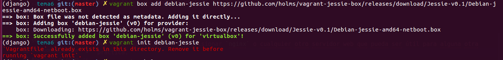

# Ejercicios Tema 6 (Gestión de infraestructuras virtuales)

## Ejercicio 1

### Instalar chef en la máquina virtual que vayamos a usar

**NO REALIZADO**

## Ejercicio 2

### Crear una receta para instalar la aplicación que se viene creando en la asignatura en alguna máquina virtual o servidor en la nube.  

**NO REALIZADO**

## Ejercicio 3

### Desplegar la aplicación de DAI con todos los módulos necesarios usando un *playbook* de Ansible.

Para poder acceder a la máquina virtual mediante HTTP, tenemos que abrir el puerto 80 para conexiones entrantes. En Azure, podemos hacerlo desde el portal web, accediendo al Network Security Group en el que se encuentra nuestra MV, clickando el botón que hay a la derecha de "Inbound security rules" y añadiendo una regla para el protocolo HTTP (o seleccionando el puerto 80 de forma manual):

Como yo no estoy cursando la asignatura DAI este año, voy a crear un playbook para instalar el servidor Apache en mi máquina virtual de Azure (creada para un ejercicio del tema anterior). 

**[Playbook para provisionar y lanzar un servidor Apache](./scripts/ej3.yml)**

Como normalmente los servidores web proveen una página web por defecto, voy a comprobar que todo funciona accediendo al dominio de mi MV mediante el navegador.

## Ejercicio 4

### Instalar una máquina virtual Debian usando Vagrant y conectar con ella.

Primero, debemos debemos buscar el archivo .box de la MV que queremos instalar, y añadirla a nuestro Vagrant con `vagrant box add`. A continuación, he intentado crear el Vagrantfile con `vagrant init`, pero me ha dado error puesto que ya tenía en esa carpeta el Vagrantfile de haber hecho la prueba con CentOS.

Una vez generado el nuevo Vagrantfile, no he podido lanzarlo porque VirtualBox ya estaba ejecutándose con CentOS. He eliminado la MV referenciándola por su ID, y he hecho `vagrant up` para lanzar la nueva MV.

Finalmente, ya podemos conectar mediante SSH con la MV utilizando `vagrant ssh`:

## Ejercicio 5

### Crear un script para provisionar `nginx` o cualquier otro servidor web que pueda ser útil para alguna otra práctica.

*NOTA: Los datos de la MV han cambiado en este ejercicio (salvo el nombre de dominio) porque he cambiado de suscripción y he tenido que crear otra MV.*

He creado un Vagrantfile para provisionar una MV con nginx, utilizando la `shell` con un script inline de apt como sistema de provisión.

**[Playbook para provisionar y lanzar un servidor nginx](./scripts/Vagrantfile)**

Para desplegarlo, primero hemos de eliminar la MV `default` (puesto que ya está provisionada con Debian debido al ejercicio anterior) o crear una nueva MV, y hacer `vagrant up` en el directorio donde se encuentre el Vagrantfile.

Lo desplegamos con `ansible-playbook` (con la opción -i indicamos el fichero de inventario que queremos utilizar). Para poder instalar los servidores de BD, necesitamos actualizar previamente la caché de paquetes del servidor; para ello, activamos la opción *update_cache* en la llamada al módulo `apt` en dicha tarea.

Podemos comprobar que ha funcionado correctamente accediendo al dominio desde el navegador:

Para comprobar que la MV ha sido bien desplegada y provisionada, no podemos acceder mediante el navegador puesto que vagrant sólo activa por defecto la conexión SSH en la MV, ya que es la única que necesita para provisionarla. Entramos con SSH y comprobamos que nginx ha sido efectivamente instalado y activado:

## Ejercicio 6

### Configurar tu máquina virtual usando vagrant con el provisionador chef.
	
**NO REALIZADO**
